# Step 2 – Designing the Data Warehouse Model

**Exercise 1 – Data Storage | Olist Data Warehouse**

---

## 2.1 – Select Business Process (10 points)

### Selected Business Processes

Based on the requirements gathered in Step 1, the following four core business processes were selected for the Olist Data Warehouse:

| # | Business Process | Source Tables | Justification |
|---|---|---|---|
| 1 | **Order Sales** | `olist_orders`, `olist_order_items`, `olist_products`, `olist_sellers`, `olist_customers` | Core revenue-generating process. Supports sales tracking, product performance, and seller scorecards. |
| 2 | **Order Payment** | `olist_orders`, `olist_order_payments`, `olist_customers` | Payments can be split across multiple methods. Needs separate modeling to analyze payment method trends and installment behavior. |
| 3 | **Order Delivery Lifecycle** | `olist_orders`, `olist_customers`, `olist_sellers` | Tracks milestones from purchase → approval → carrier → delivered vs. estimated. Critical for delivery performance KPIs. |
| 4 | **Customer Review & Satisfaction** | `olist_order_reviews`, `olist_orders`, `olist_order_items`, `olist_customers`, `olist_sellers`, `olist_products` | Customer satisfaction is a key driver of seller rankings. Review scores and sentiment feed clustering and churn detection models. |

**Why these four?**
All four directly map to the four analytical objectives Olist stakeholders defined:
- Customer Satisfaction → Business Process 4
- Sales Prediction → Business Process 1 + Periodic Snapshot
- Delivery Performance → Business Process 3
- Payment Analysis → Business Process 2

---

## 2.2 – Declare Grain (10 points)

The grain defines the most atomic level of detail stored in each fact table. Declaring the grain prevents ambiguity and ensures accurate aggregations.

| Fact Table | Type | Grain |
|---|---|---|
| `fact_order_items` | Transaction | **One row per order item** (an order can have multiple items from multiple sellers) |
| `fact_order_payments` | Transaction | **One row per payment transaction per order** (an order can have multiple payment methods) |
| `fact_order_delivery` | Accumulating Snapshot | **One row per order** (tracks all lifecycle milestone dates for a single order) |
| `fact_monthly_sales` | Periodic Snapshot | **One row per seller per product category per calendar month** |
| `fact_order_reviews` | Transaction | **One row per review** (one review per order, tied back to order items for seller/product attribution) |

**Grain Decisions & Rationale:**

- **`fact_order_items`**: Choosing order-item grain (not order grain) enables product- and seller-level revenue analysis without aggregation loss.
- **`fact_order_payments`**: Payment-level grain is necessary because one order can use multiple payment types with different installment counts.
- **`fact_order_delivery`**: Order-level grain is appropriate because delivery milestones belong to a single order (not individual items). Multiple date dimension FKs capture each milestone.
- **`fact_monthly_sales`**: A pre-aggregated periodic snapshot at month/seller/category grain allows fast executive reporting without scanning the entire transaction history each time.
- **`fact_order_reviews`**: Review-level grain. One review per order; joined back to order items to distribute review scores across sellers and products.

---

## 2.3 – Identify the Dimensions (20 points)

### Dimension Tables

---

#### `dim_date`

| Attribute | Data Type | Description |
|---|---|---|
| `date_key` | INT (PK) | Surrogate key (YYYYMMDD format, e.g., 20170901) |
| `full_date` | DATE | Full calendar date |
| `day_of_week` | INT | 1 = Monday ... 7 = Sunday |
| `day_name` | VARCHAR(10) | e.g., "Monday" |
| `day_of_month` | INT | 1–31 |
| `week_of_year` | INT | ISO week number |
| `month` | INT | 1–12 |
| `month_name` | VARCHAR(10) | e.g., "January" |
| `quarter` | INT | 1–4 |
| `year` | INT | e.g., 2017 |
| `is_weekend` | BOOLEAN | TRUE if Saturday or Sunday |
| `is_holiday` | BOOLEAN | Brazilian public holidays flag |

**Key behavior:** Role-playing dimension — appears multiple times in `fact_order_delivery` under aliases (`purchase_date_key`, `approval_date_key`, `carrier_date_key`, `delivered_date_key`, `estimated_delivery_date_key`).

---

#### `dim_customer`

| Attribute | Data Type | Description |
|---|---|---|
| `customer_key` | INT (PK) | Surrogate key |
| `customer_id` | VARCHAR(50) | Natural key (per-order customer ID from source) |
| `customer_unique_id` | VARCHAR(50) | Unique identifier across all orders for same customer |
| `customer_city` | VARCHAR(100) | City of the customer |
| `customer_state` | VARCHAR(10) | State abbreviation (e.g., "SP") |
| `customer_zip_code_prefix` | VARCHAR(10) | Zip code prefix |

**Key behavior:** SCD Type 1. `customer_unique_id` is the business key; `customer_id` is order-scoped and can repeat for same unique customer.

---

#### `dim_seller`

| Attribute | Data Type | Description |
|---|---|---|
| `seller_key` | INT (PK) | Surrogate key |
| `seller_id` | VARCHAR(50) | Natural key |
| `seller_city` | VARCHAR(100) | City where seller is located |
| `seller_state` | VARCHAR(10) | State abbreviation |
| `seller_zip_code_prefix` | VARCHAR(10) | Zip code prefix |

**Key behavior:** SCD Type 1. Shared (conformed) across all fact tables.

---

#### `dim_product`

| Attribute | Data Type | Description |
|---|---|---|
| `product_key` | INT (PK) | Surrogate key |
| `product_id` | VARCHAR(50) | Natural key |
| `product_category_name` | VARCHAR(100) | Category in Portuguese |
| `product_category_name_english` | VARCHAR(100) | Category in English (from translation table) |
| `product_weight_g` | FLOAT | Product weight in grams |
| `product_length_cm` | FLOAT | Length in centimeters |
| `product_height_cm` | FLOAT | Height in centimeters |
| `product_width_cm` | FLOAT | Width in centimeters |
| `product_photos_qty` | INT | Number of product photos |
| `product_name_length` | INT | Character count of product name |
| `product_description_length` | INT | Character count of product description |

**Key behavior:** SCD Type 1. Includes physical attributes useful for freight cost analysis.

---

#### `dim_payment_type`

| Attribute | Data Type | Description |
|---|---|---|
| `payment_type_key` | INT (PK) | Surrogate key |
| `payment_type` | VARCHAR(50) | e.g., "credit_card", "boleto", "voucher", "debit_card" |

**Key behavior:** Small static lookup dimension (≤10 rows). Shared across payment and order item facts.

---

#### `dim_order_status`

| Attribute | Data Type | Description |
|---|---|---|
| `order_status_key` | INT (PK) | Surrogate key |
| `order_status` | VARCHAR(50) | e.g., "delivered", "shipped", "canceled", "processing" |

**Key behavior:** Small static lookup dimension. Used in delivery snapshot and order items facts.

---

#### `dim_geolocation` *(optional enrichment)*

| Attribute | Data Type | Description |
|---|---|---|
| `geolocation_key` | INT (PK) | Surrogate key |
| `zip_code_prefix` | VARCHAR(10) | Natural key |
| `geolocation_lat` | FLOAT | Latitude |
| `geolocation_lng` | FLOAT | Longitude |
| `geolocation_city` | VARCHAR(100) | City name |
| `geolocation_state` | VARCHAR(10) | State abbreviation |

**Key behavior:** Can be joined to `dim_customer` and `dim_seller` via zip code for geographic distance calculations.

---

## 2.4 – Identify the Facts

### 2.4.1 – Single Type of Fact Table (10 points)

If only one type (Transaction) were used, all analytical needs would collapse into one fact table:

#### `fact_order_items` (Transaction Fact Table)

| Column | Data Type | Role |
|---|---|---|
| `order_item_key` | INT (PK) | Surrogate key |
| `order_id` | VARCHAR(50) | Degenerate dimension (from source) |
| `order_item_id` | INT | Item sequence within order |
| `customer_key` | INT (FK → dim_customer) | |
| `seller_key` | INT (FK → dim_seller) | |
| `product_key` | INT (FK → dim_product) | |
| `purchase_date_key` | INT (FK → dim_date) | Date of order placement |
| `order_status_key` | INT (FK → dim_order_status) | |
| **Measures** | | |
| `price` | NUMERIC(10,2) | Item price paid by customer |
| `freight_value` | NUMERIC(10,2) | Freight cost for this item |
| `total_value` | NUMERIC(10,2) | price + freight_value |
| `days_to_deliver` | FLOAT | Computed delivery duration (if available) |
| `review_score` | INT | Average/first review score (denormalized) |

**Limitation of single fact table approach:** Blending payment data, delivery milestones, and review data into one table creates NULL-heavy rows and inaccurate aggregations (e.g., summing payment values when multiple payments exist per order would duplicate rows).

---

### 2.4.2 – Multiple Types of Fact Tables (20 points)

Using three fact table types solves the limitations above:

---

#### Fact Table 1: `fact_order_items` — **Transaction Fact**

**Grain:** One row per order item

| Column | Data Type | Role |
|---|---|---|
| `order_item_key` | SERIAL (PK) | Surrogate key |
| `order_id` | VARCHAR(50) | Degenerate dimension |
| `order_item_id` | INT | Item number within order |
| `customer_key` | INT (FK → dim_customer) | |
| `seller_key` | INT (FK → dim_seller) | |
| `product_key` | INT (FK → dim_product) | |
| `purchase_date_key` | INT (FK → dim_date) | |
| `order_status_key` | INT (FK → dim_order_status) | |
| **Measures** | | |
| `price` | NUMERIC(10,2) | Item listed price |
| `freight_value` | NUMERIC(10,2) | Freight allocated to this item |
| `total_value` | NUMERIC(10,2) | price + freight_value |

**Use cases:** Revenue by seller, revenue by product category, average order value, top products.

---

#### Fact Table 2: `fact_order_payments` — **Transaction Fact**

**Grain:** One row per payment transaction per order

| Column | Data Type | Role |
|---|---|---|
| `payment_key` | SERIAL (PK) | Surrogate key |
| `order_id` | VARCHAR(50) | Degenerate dimension |
| `payment_sequential` | INT | Payment sequence within order |
| `customer_key` | INT (FK → dim_customer) | |
| `payment_type_key` | INT (FK → dim_payment_type) | |
| `purchase_date_key` | INT (FK → dim_date) | |
| **Measures** | | |
| `payment_installments` | INT | Number of installments |
| `payment_value` | NUMERIC(10,2) | Amount paid in this transaction |
| `is_high_installment` | BOOLEAN | TRUE if installments > 6 |

**Use cases:** Payment method market share, installment behavior by category, total revenue by payment type.

---

#### Fact Table 3: `fact_order_delivery` — **Accumulating Snapshot Fact**

**Grain:** One row per order (updated as milestones are reached)

| Column | Data Type | Role |
|---|---|---|
| `delivery_key` | SERIAL (PK) | Surrogate key |
| `order_id` | VARCHAR(50) | Degenerate dimension |
| `customer_key` | INT (FK → dim_customer) | |
| `seller_key` | INT (FK → dim_seller) | Seller of first/primary item |
| `order_status_key` | INT (FK → dim_order_status) | Current status (updated) |
| `purchase_date_key` | INT (FK → dim_date) | Order placement date |
| `approval_date_key` | INT (FK → dim_date) | Order approval date |
| `carrier_date_key` | INT (FK → dim_date) | Carrier pickup date |
| `delivered_date_key` | INT (FK → dim_date) | Actual delivery to customer |
| `estimated_delivery_date_key` | INT (FK → dim_date) | Estimated delivery date shown to customer |
| **Measures** | | |
| `days_to_approve` | FLOAT | Approval date − Purchase date |
| `days_to_ship` | FLOAT | Carrier date − Approval date |
| `days_to_deliver` | FLOAT | Delivered date − Carrier date |
| `delivery_delay_days` | FLOAT | Delivered date − Estimated date (negative = early) |
| `is_on_time` | BOOLEAN | TRUE if delivered_date ≤ estimated_date |

**Behavior:** Row is inserted when an order is placed. Date FKs for unmet milestones are set to a special "Not Yet" date key (e.g., `date_key = 0`). Each ETL run updates milestones as they occur. `order_status_key` is overwritten with the current status.

**Use cases:** Average time-to-approve by seller state, delivery delay distribution, on-time delivery rate by region.

---

#### Fact Table 4: `fact_monthly_sales` — **Periodic Snapshot Fact**

**Grain:** One row per seller per product category per calendar month

| Column | Data Type | Role |
|---|---|---|
| `monthly_sales_key` | SERIAL (PK) | Surrogate key |
| `snapshot_month_key` | INT (FK → dim_date) | First day of the snapshot month |
| `seller_key` | INT (FK → dim_seller) | |
| `product_category` | VARCHAR(100) | Product category (English) |
| **Measures** | | |
| `total_orders` | INT | Distinct orders containing this seller+category |
| `total_items_sold` | INT | Total items sold |
| `total_revenue` | NUMERIC(12,2) | Sum of price for this seller+category+month |
| `total_freight` | NUMERIC(12,2) | Sum of freight_value |
| `avg_review_score` | FLOAT | Average review score for orders in this month |
| `on_time_delivery_rate` | FLOAT | % of orders delivered on time (0–1) |
| `total_reviews` | INT | Count of reviews received |

**Behavior:** Populated by a monthly batch job. Does not update historical rows; a new row is inserted each month. Enables fast trend analysis without scanning full transaction history.

**Use cases:** Month-over-month revenue trends, seller performance scorecards, seasonal category analysis.

---

#### Fact Table 5: `fact_order_reviews` — **Transaction Fact**

**Grain:** One row per review (one review per order)

| Column | Data Type | Role |
|---|---|---|
| `review_key` | SERIAL (PK) | Surrogate key |
| `review_id` | VARCHAR(50) | Degenerate dimension |
| `order_id` | VARCHAR(50) | Degenerate dimension |
| `customer_key` | INT (FK → dim_customer) | |
| `review_creation_date_key` | INT (FK → dim_date) | Date review was submitted |
| `review_answer_date_key` | INT (FK → dim_date) | Date Olist responded |
| **Measures** | | |
| `review_score` | INT | Rating 1–5 |
| `has_comment_title` | BOOLEAN | TRUE if review title is not null |
| `has_comment_message` | BOOLEAN | TRUE if review body is not null |
| `days_to_review` | FLOAT | Review creation − Order delivery date |

**Use cases:** Average satisfaction by product category, review score distribution, sentiment tagging input, NPS proxy.

---

## 2.5 – Full ERD (10 points)

```mermaid
erDiagram

    dim_date {
        int date_key PK
        date full_date
        int day_of_week
        string day_name
        int day_of_month
        int week_of_year
        int month
        string month_name
        int quarter
        int year
        boolean is_weekend
        boolean is_holiday
    }

    dim_customer {
        int customer_key PK
        string customer_id
        string customer_unique_id
        string customer_city
        string customer_state
        string customer_zip_code_prefix
    }

    dim_seller {
        int seller_key PK
        string seller_id
        string seller_city
        string seller_state
        string seller_zip_code_prefix
    }

    dim_product {
        int product_key PK
        string product_id
        string product_category_name
        string product_category_name_english
        float product_weight_g
        float product_length_cm
        float product_height_cm
        float product_width_cm
        int product_photos_qty
    }

    dim_payment_type {
        int payment_type_key PK
        string payment_type
    }

    dim_order_status {
        int order_status_key PK
        string order_status
    }

    fact_order_items {
        int order_item_key PK
        string order_id
        int order_item_id
        int customer_key FK
        int seller_key FK
        int product_key FK
        int purchase_date_key FK
        int order_status_key FK
        decimal price
        decimal freight_value
        decimal total_value
    }

    fact_order_payments {
        int payment_key PK
        string order_id
        int payment_sequential
        int customer_key FK
        int payment_type_key FK
        int purchase_date_key FK
        int payment_installments
        decimal payment_value
        boolean is_high_installment
    }

    fact_order_delivery {
        int delivery_key PK
        string order_id
        int customer_key FK
        int seller_key FK
        int order_status_key FK
        int purchase_date_key FK
        int approval_date_key FK
        int carrier_date_key FK
        int delivered_date_key FK
        int estimated_delivery_date_key FK
        float days_to_approve
        float days_to_ship
        float days_to_deliver
        float delivery_delay_days
        boolean is_on_time
    }

    fact_monthly_sales {
        int monthly_sales_key PK
        int snapshot_month_key FK
        int seller_key FK
        string product_category
        int total_orders
        int total_items_sold
        decimal total_revenue
        decimal total_freight
        float avg_review_score
        float on_time_delivery_rate
        int total_reviews
    }

    fact_order_reviews {
        int review_key PK
        string review_id
        string order_id
        int customer_key FK
        int review_creation_date_key FK
        int review_answer_date_key FK
        int review_score
        boolean has_comment_title
        boolean has_comment_message
        float days_to_review
    }

    %% fact_order_items relationships
    fact_order_items }o--|| dim_customer : "customer_key"
    fact_order_items }o--|| dim_seller : "seller_key"
    fact_order_items }o--|| dim_product : "product_key"
    fact_order_items }o--|| dim_date : "purchase_date_key"
    fact_order_items }o--|| dim_order_status : "order_status_key"

    %% fact_order_payments relationships
    fact_order_payments }o--|| dim_customer : "customer_key"
    fact_order_payments }o--|| dim_payment_type : "payment_type_key"
    fact_order_payments }o--|| dim_date : "purchase_date_key"

    %% fact_order_delivery relationships (role-playing dim_date)
    fact_order_delivery }o--|| dim_customer : "customer_key"
    fact_order_delivery }o--|| dim_seller : "seller_key"
    fact_order_delivery }o--|| dim_order_status : "order_status_key"
    fact_order_delivery }o--|| dim_date : "purchase_date_key"
    fact_order_delivery }o--|| dim_date : "approval_date_key"
    fact_order_delivery }o--|| dim_date : "carrier_date_key"
    fact_order_delivery }o--|| dim_date : "delivered_date_key"
    fact_order_delivery }o--|| dim_date : "estimated_delivery_date_key"

    %% fact_monthly_sales relationships
    fact_monthly_sales }o--|| dim_date : "snapshot_month_key"
    fact_monthly_sales }o--|| dim_seller : "seller_key"

    %% fact_order_reviews relationships
    fact_order_reviews }o--|| dim_customer : "customer_key"
    fact_order_reviews }o--|| dim_date : "review_creation_date_key"
    fact_order_reviews }o--|| dim_date : "review_answer_date_key"
```

### ERD Notes

- `dim_date` is a **role-playing dimension** — it appears multiple times in `fact_order_delivery` under different aliases. In physical implementation, all aliases point to the same `dim_date` table.
- All fact tables use **surrogate keys** as primary keys and **natural/degenerate keys** (e.g., `order_id`) for lineage tracing back to source systems.
- `fact_order_items` and `fact_order_reviews` are joined via the `order_id` degenerate dimension (not a direct FK to each other).
- `fact_monthly_sales` uses `product_category` as a denormalized column (string) rather than a FK to `dim_product` because it is aggregated at the category level, not individual product level.

---

## 2.6 – Bus Matrix (10 points)

The Bus Matrix maps each fact table to the shared (conformed) dimensions it uses. It serves as the master integration plan for the data warehouse.

| Dimension | fact_order_items | fact_order_payments | fact_order_delivery | fact_monthly_sales | fact_order_reviews |
|---|:---:|:---:|:---:|:---:|:---:|
| **dim_date** (purchase) | ✓ | ✓ | ✓ | ✓ | |
| **dim_date** (approval) | | | ✓ | | |
| **dim_date** (carrier) | | | ✓ | | |
| **dim_date** (delivered) | | | ✓ | | |
| **dim_date** (estimated) | | | ✓ | | |
| **dim_date** (review created) | | | | | ✓ |
| **dim_date** (review answered) | | | | | ✓ |
| **dim_customer** | ✓ | ✓ | ✓ | | ✓ |
| **dim_seller** | ✓ | | ✓ | ✓ | |
| **dim_product** | ✓ | | | | |
| **dim_payment_type** | | ✓ | | | |
| **dim_order_status** | ✓ | | ✓ | | |

### Bus Matrix Interpretation

- **dim_date** and **dim_customer** are the most widely shared conformed dimensions — they appear in 4–5 fact tables, making them the backbone of cross-process analysis.
- **dim_seller** is shared across sales, delivery, and monthly snapshot — enabling consistent seller performance tracking across all three processes.
- **dim_product** is only used in `fact_order_items` (transaction grain). Monthly snapshots use `product_category` as a denormalized string because they are pre-aggregated.
- **dim_payment_type** is exclusive to `fact_order_payments` — payment method information is not needed in other processes.
- Drilling across fact tables (e.g., "compare delivery delay vs. review score for the same customer") is possible via the shared `dim_customer` conformed dimension.

---
